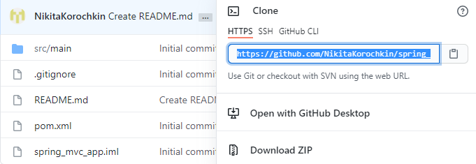
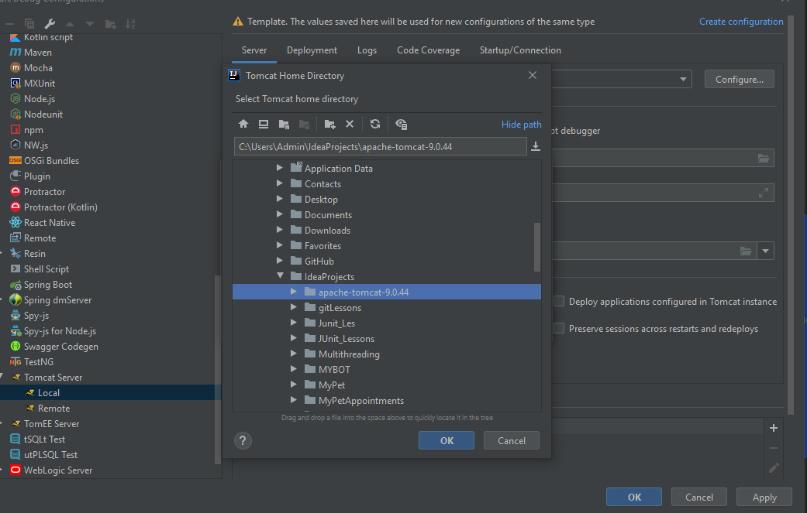
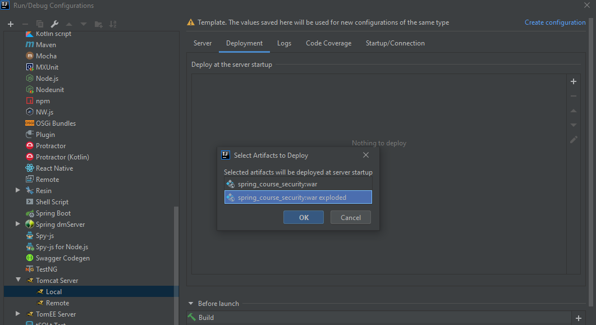

# spring_mvc_validation

## Описание
Spring MVC приложение, в котором реализован следующий функционал:

- Обработка запросов в Controller
- Хранение данных с помощью Model
- Использование данных во view
- Реализация Spring MVC форм:
    
  - input
  - select
  - radiobutton
  - checkbox  

- Валидация данных, создание собственной аннотации
---
## Технологии 
Spring MVC, Tomcat 9, JSTL

---
## Запуск
В данном репозитории я оставил свою конфигурацию для легкого запуска.

Для запуска приложения необходимо совершить следующие действия:

1. Клонировать репозиторий с проектом к себе на компьютер:
    
    
    В командной строке проходим до нужной директории, куда и будет клонирован репозиторий 
    `$ cd YOUR_DIRECTORY`, далее прописываем команду `$ git clone URL`. Репозиторий клонирован.

2. Открыть Intellij Idea: File -> Open -> ... -> spring_mvc_validation

3. Настроить сервер Tomcat
   
    Intellij Idea нажимаем на Edit Configuration рядом с кнопкой запуска, выбираем Tomcat Server -> Local, в появившемся окне нажимаем Configure и находим архив tomcat (скачиваем при необходимости)

Переходим в Deployment, добавляем артефакт war_exploded

Нажимаем Apply, OK. Сервер готов.

Теперь запускаем сервер. В браузере переходим по адресу http://localhost:8080/spring_mvc/employee/

Приложение запущено!
